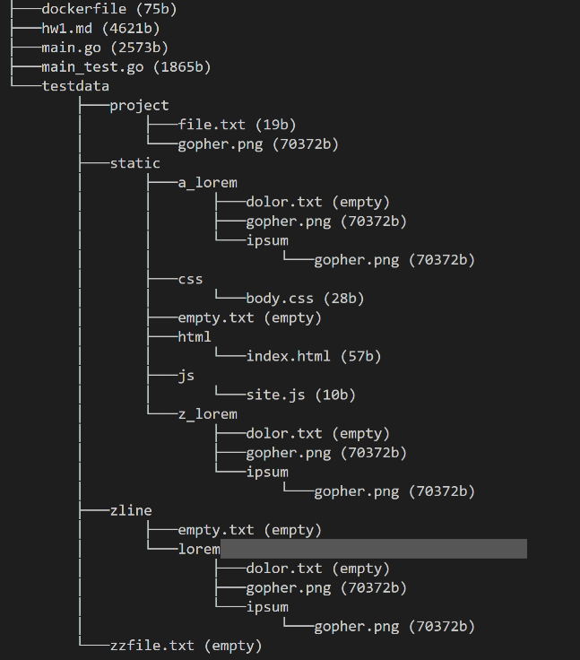

# go_filesystem
Directory tree written in Go

![]


To run the project locally, download Go and have the $GO_PATH set up. 

cd into the project folder and try the tests:

```
$ go test -v
=== RUN   TestTreeFull
--- PASS: TestTreeFull (0.00s)
=== RUN   TestTreeDir
--- PASS: TestTreeDir (0.00s)
PASS
```

then run with 

```
go run main.go . -f.
```

### Docker
To run using the Docker image, type

```
docker build -t mailgo_hw1
```
